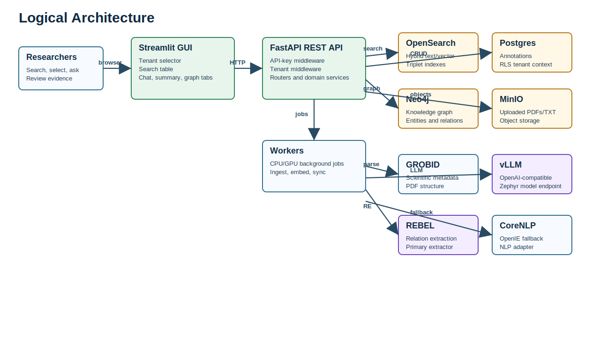
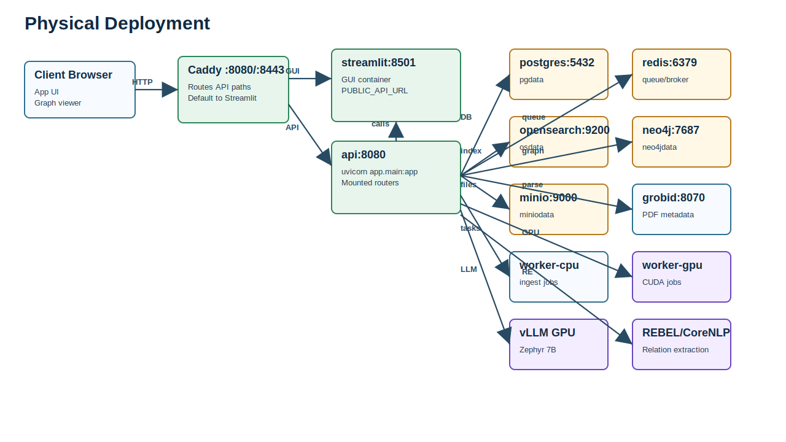
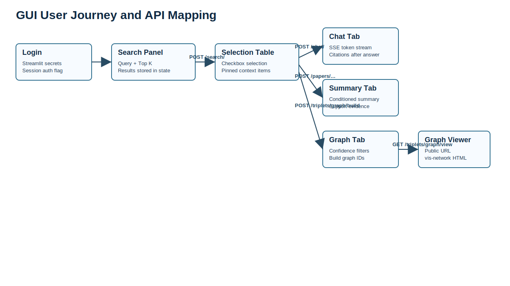
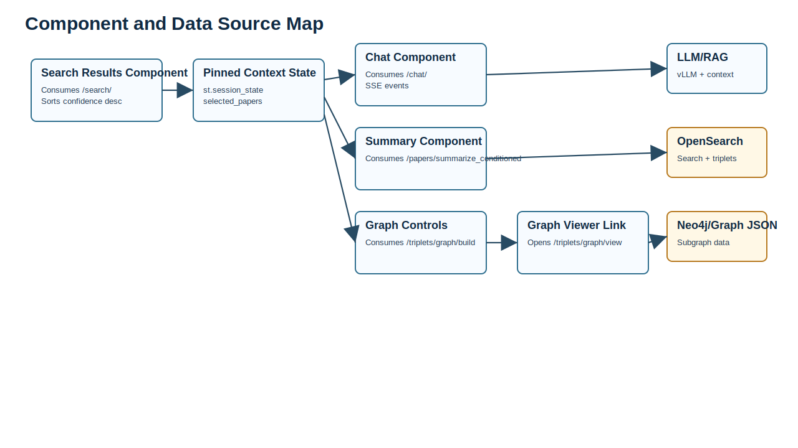
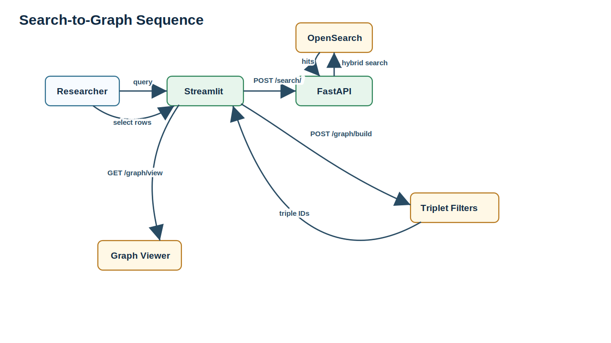

# Sabia: AI Research Insights

<p align="center">
  
</p>

**Technical Report for the REST API and Integrated GUI**

**Authors**

Ignacio Arroyo Fernández (Universidad Tecnológica de la Mixteca, UTM, iaf [at] gs [dot] utm [dot] mx), Eduardo Varela Hernández (LaSalle Oaxaca), and Luis Felipe Morales (LaSalle Oaxaca).

Project context: academic research project funded by **Secihti Ciencia de Frontera, Grant CF-2023-I-2854**.

Source inspected: `blue-demon:/home/iarroyof/sabia/ai-research-insights`

GitHub repository: https://github.com/iarroyof/ai-research-insights

Verified commit: `54029058dc360cf000e053d08f6d49979c3bcd63`

Report date: `2026-04-25`

## Executive Summary

Sabia: AI Research Insights is a containerized biomedical research platform for searching scientific evidence, selecting relevant sentences/triplets, generating context-grounded summaries and chat answers, and visualizing extracted biomedical knowledge as an interactive graph. The system combines a Streamlit GUI, a FastAPI REST API, tenant-aware middleware, hybrid search, object storage, relational annotation storage, graph storage, GPU-backed LLM inference, relation extraction, and background workers.

The current deployed API surface is defined by `services/api/app/main.py`. It mounts the `search`, `chat`, `triplets`, `papers`, `annotations`, and CSV ingest routers. Several additional router files exist in the repository but are not mounted; they are documented separately because source presence alone does not make them reachable through the running FastAPI app. The dataset and lung-cancer knowledge-base construction context is aligned with the scalable lung cancer knowledge-base work reported by Martínez Cisneros et al. (2025), while the semantic reasoning and attention-based modeling context is aligned with Balderas-Martínez et al. (2025).

## 1. Project Overview and Architecture

### Core Problem

Biomedical literature review requires repeated movement between papers, snippets, relation extraction output, and expert interpretation. The project addresses this by combining:

- search over indexed scientific sentences and extracted triplets;
- user selection of relevant evidence;
- LLM-assisted chat and conditioned summarization grounded in selected context;
- entity/relation triplet extraction and filtering;
- interactive knowledge graph exploration;
- annotation capture for later review, curation, or model-improvement workflows.

The software is not just a search UI. It is an evidence workbench where the REST API exposes the retrieval, ingestion, summarization, graph, and annotation capabilities, while the GUI orchestrates those capabilities into a researcher-facing workflow. Its data and knowledge-base workflow should be read as an implementation-oriented continuation of scalable biomedical knowledge-base construction methods for lung cancer literature (Martínez Cisneros et al., 2025).

### Logical Architecture



Mermaid source: [docs/diagrams/logical-architecture.mmd](docs/diagrams/logical-architecture.mmd)

### Physical Deployment Architecture



Mermaid source: [docs/diagrams/physical-deployment.mmd](docs/diagrams/physical-deployment.mmd)

### Main Runtime Components

- **Caddy** listens on ports `8080` and `8443`. It reverse-proxies API paths such as `/search*`, `/chat*`, `/papers*`, `/triplets*`, `/annotations*`, and `/health` to the FastAPI service. All other paths are routed to Streamlit.
- **FastAPI API** runs `uvicorn app.main:app --host 0.0.0.0 --port 8080` and exposes the REST API.
- **Streamlit GUI** provides the researcher workflow and calls the API using `httpx`.
- **Postgres** stores relational application data such as annotations and uses a tenant context intended for RLS policies.
- **OpenSearch** stores searchable sentence/triplet indexes and supports hybrid lexical/vector retrieval.
- **Neo4j** stores graph representations for entities and relations.
- **MinIO** stores uploaded PDF/TXT objects.
- **Redis/Celery workers** support asynchronous ingestion and processing work.
- **GROBID** extracts structured metadata from scientific PDFs.
- **vLLM** serves an OpenAI-compatible local LLM endpoint using `HuggingFaceH4/zephyr-7b-beta`.
- **REBEL** is the primary relation extraction service. CoreNLP/OpenIE is configured as a fallback path.

### Technology Stack

| Layer | Technologies Observed |
| --- | --- |
| API framework | Python, FastAPI `0.112.0`, Uvicorn `0.30.5`, Pydantic `2.8.2`, Pydantic Settings |
| GUI | Streamlit `1.38.0`, `httpx`, Streamlit session state, Streamlit secrets |
| Search | OpenSearch `2.13.0`, BM25/vector hybrid settings, sentence-transformers optional embeddings |
| Data storage | Postgres `16`, MinIO, Neo4j `5.23.0-community`, Redis |
| Background processing | Celery `5.4.0`, CPU/GPU worker containers |
| NLP/AI | vLLM OpenAI-compatible server, Zephyr 7B, REBEL, Stanford CoreNLP, GROBID, transformers, torch, spaCy/scispaCy |
| Proxy/deployment | Docker Compose, Caddy, NVIDIA runtime for GPU containers |
| API documentation style | FastAPI/OpenAPI-ready route definitions, supplemented here by source-derived technical documentation |

The semantic modeling layer combines indexed triplets, vector search, entity/relation representations, and context-conditioned LLM prompting. This design is consistent with prior work on semantic reasoning with standard attention-based models in chronic disease literature, where attention-based representations are used to support semantic inference over biomedical text (Balderas-Martínez et al., 2025).

## 2. REST API Specification

### Base URLs

- Internal Docker network API URL: `http://api:8080`
- Host-published API URL in Compose: `http://localhost:18081`
- Caddy public API paths: `http://localhost:8080/<api-path>`
- Streamlit public path: `http://localhost:8080/` through Caddy fallback routing

### Required Headers

| Header | Required | Purpose |
| --- | --- | --- |
| `X-API-Key` | Required for all non-public endpoints | Compared against `API_KEY` environment variable or `security.api_key` from config. |
| `X-Tenant-Id` | Required for all normal endpoints except `/health`; optional/query fallback for `/triplets/graph/view` | Sets `request.state.tenant_id`; used by storage/search/annotation operations. |
| `Content-Type: application/json` | Required for JSON POST/PUT requests | Tells FastAPI to parse JSON bodies. |
| `x-user-id` | Optional for annotation endpoints | Stored as annotation `user_id` when provided. |

Public paths in current middleware: `/health` and `/triplets/graph/view*`.

### Deployed Endpoint Inventory

| Method | URI | Tag | Auth | Purpose |
| --- | --- | --- | --- | --- |
| GET | /health | Health | Public | Returns {'status':'ok'}. |
| POST | /search/ | Search | API key + tenant | Hybrid search over papers/triplets/chats target model. Returns items alias for hits. |
| POST | /chat/ | Chat | API key + tenant | Streams server-sent events with token, citations, and final messages. |
| POST | /papers/upload | Papers | API key + tenant | Multipart PDF/TXT upload to MinIO; enqueues URI ingestion when task helper is wired. |
| POST | /papers/link | Papers | API key + tenant | Accepts article/direct links and enqueues link ingestion when task helper is wired. |
| POST | /papers/ncbi | Papers | API key + tenant | Accepts PMID list and enqueues NCBI ingestion when task helper is wired. |
| POST | /papers/summarize_conditioned | Papers | API key + tenant | RAG/LLM summary over selected items; returns paragraphs and support sentences. |
| POST | /triplets/csv | Triplets | API key + tenant | Uploads CSV triplets; validates entity probabilities and confidence thresholds. |
| POST | /triplets/ingest_csv | Triplets | API key + tenant | Uploads CSV through ingest_csv_triplets helper. |
| POST | /triplets/suggest | Triplets | API key + tenant | Runs relation extraction on supplied sentences. |
| POST | /triplets/graph/build | Triplets | API key + tenant | Builds graph candidate triple IDs from selected sentences. |
| GET | /triplets/graph | Triplets | API key + tenant | Returns graph JSON for comma-separated triple IDs. |
| GET | /triplets/graph/view | Graph | Public API key bypass; tenant header/query | Returns browser-friendly vis-network HTML graph viewer. |
| GET | /triplets/search | Triplets | API key + tenant | Searches triplet index by q, confidence_min, entity_type, and pmid. |
| POST | /triplets/classify | Classification | API key + tenant | Classifies entities with the NER/zero-shot classifier. |
| POST | /triplets/sync | Sync | API key + tenant | Manually syncs OpenSearch triplets into Neo4j. |
| POST | /annotations | Annotations | API key + tenant | Creates one annotation with optional idempotency key. |
| POST | /annotations/batch | Annotations | API key + tenant | Creates up to 500 annotations. |
| GET | /annotations | Annotations | API key + tenant | Lists annotations with filters and cursor pagination. |
| PUT | /annotations/{annotation_id} | Annotations | API key + tenant | Updates kind, payload, page, or bbox. |
| DELETE | /annotations/{annotation_id} | Annotations | API key + tenant | Deletes annotation for current tenant. |
| GET | /annotations/export | Annotations | API key + tenant | Streams NDJSON annotations for downstream training/RLHF workflows. |

### Source Routers Not Currently Mounted

These files exist under `services/api/app/routers`, but `services/api/app/main.py` does not include them with `app.include_router(...)`.

| Method | URI | Source | Status |
| --- | --- | --- | --- |
| POST | /chat/history/search | chat_history.py | Defined as POST but not mounted; Streamlit currently calls GET, so the GUI history search will not work unless mounted and aligned. |
| GET | /chat/session/{session_id}/messages | chat_sessions.py | Defined but not mounted. |
| POST | /export/triples.csv | export.py | Defined but not mounted. |
| POST | /jobs/backfill/probabilities | jobs.py | Defined but not mounted. |
| POST | /predict/probabilities | probabilities.py | Defined but not mounted. |

### Request and Response Models

| Model | Fields |
| --- | --- |
| SearchRequest | `query: str`, `target: papers|triplets|chats|all = all`, `filters: object = {}`, `k: 1..200 = 20` |
| SearchResponse/SearchHit | `items`: list of hits with `paper_id`, `title`, `pmid`, `pmcid`, `page`, `sent_id`, `score`, `text`, `subject`, `relation`, `object`, `confidence`. |
| ChatRequest | `message: str`, `items: ChatItem[]`, `session_id?: str`, `options: {allow_extra_retrieval, token_budget, confidence_min}`. |
| ConditionedSummaryRequest | `message: str`, `items: ConditionedSummaryItem[]`, `options: object`. |
| ConditionedSummaryResponse | `paragraphs`: list of `{text, support[]}` where support carries sentence provenance and SVO fields. |
| UploadResponse | `job_id`, `num_files`, `objects` stored as `s3://bucket/tenant/uploads/...`. |
| AnnotationCreate | `paper_id`, `sent_id?`, `kind: highlight|note|like|unlike`, `payload`, `page?`, `bbox?`, `idempotency_key?`. |
| AnnotationOut | `id`, `paper_id`, `sent_id`, `kind`, `payload`, `page`, `bbox`, `user_id`, `created_at`. |
| Triplet graph build response | `triple_ids`, `count`, and `debug` metadata with selected item count, paper IDs, query terms, thresholds, and top_k. |
| Classify response | `results` from NER classifier and `models_available`. |


### Request and response examples

#### Health

```bash
curl http://localhost:8080/health
```

```json
{"status": "ok"}
```

#### Search

```bash
curl -X POST http://localhost:8080/search/ \
  -H "X-API-Key: $API_KEY" \
  -H "X-Tenant-Id: default" \
  -H "Content-Type: application/json" \
  -d '{"query":"immunotherapy lung carcinoma","target":"all","filters":{"confidence_min":0.6},"k":3}'
```

```json
{
  "items": [
    {
      "paper_id": "PMC123456.txt",
      "pmid": "12345678",
      "pmcid": "PMC123456",
      "sent_id": "sent-0001",
      "score": 12.84,
      "text": "PD-1 blockade improved response in lung carcinoma cohorts.",
      "subject": "PD-1 blockade",
      "relation": "improved",
      "object": "response",
      "confidence": 0.87
    }
  ]
}
```

Common errors:

```json
{"detail": "Invalid X-API-Key"}
```

```json
{"detail": "Search failed: RuntimeError: <backend message>"}
```

#### Chat with pinned context

The chat endpoint returns `text/event-stream`; clients should parse each `data:` line as JSON.

```bash
curl -N -X POST http://localhost:8080/chat/ \
  -H "X-API-Key: $API_KEY" \
  -H "X-Tenant-Id: default" \
  -H "Content-Type: application/json" \
  -d '{"message":"Summarize the evidence.","items":[{"paper_id":"PMC123456.txt","sent_id":"sent-0001","text":"PD-1 blockade improved response."}],"options":{"allow_extra_retrieval":false}}'
```

```text
data: {"type":"token","data":"PD-1 blockade..."}
data: {"type":"citations","data":{"snippets":[{"paper_id":"PMC123456.txt","sent_id":"sent-0001"}]}}
data: {"type":"final","data":{"done":true,"session_id":"6fd7e1d1-1c9b-4b5d-9a10-8ac5e9f27e33"}}
```

#### Upload papers

```bash
curl -X POST http://localhost:8080/papers/upload \
  -H "X-API-Key: $API_KEY" \
  -H "X-Tenant-Id: default" \
  -F "files=@article.pdf"
```

```json
{
  "job_id": "8a6e0f31-7e8a-4e83-b39e-bb971c2b0793",
  "num_files": 1,
  "objects": ["s3://papers/default/uploads/uuid_article.pdf"]
}
```

If the ingestion task helper is not wired:

```json
{"detail": "Ingestion task not wired. Implement app.tasks.ingest.enqueue_ingest_uris(tenant, uris) to process uploaded objects."}
```

#### Link and PMID ingestion

```json
[
  {"url": "https://pubmed.ncbi.nlm.nih.gov/12345678/", "metadata": {"topic": "immunotherapy"}}
]
```

```json
{"job_id": "link-job-id", "num_links": 1}
```

```json
{"pmids": ["12345678", "23456789"]}
```

```json
{"job_id": "pmid-job-id", "num_pmids": 2}
```

#### Conditioned summary

```json
{
  "message": "What are the main immunotherapy strategies for lung carcinoma?",
  "items": [
    {
      "paper_id": "PMC123456.txt",
      "sent_id": "sent-0001",
      "text": "PD-1 blockade improved response in lung carcinoma.",
      "subject": "PD-1 blockade",
      "relation": "improved",
      "object": "response"
    }
  ],
  "options": {"max_paragraphs": 3, "confidence_min": 0.5}
}
```

```json
{
  "paragraphs": [
    {
      "text": "The selected evidence emphasizes immune checkpoint inhibition...",
      "support": [
        {
          "paper_id": "PMC123456.txt",
          "sent_id": "sent-0001",
          "text": "PD-1 blockade improved response in lung carcinoma.",
          "subject": "PD-1 blockade",
          "predicate": "improved",
          "object": "response",
          "pmid": "12345678",
          "pmcid": "PMC123456",
          "page": 4
        }
      ]
    }
  ]
}
```

#### CSV triplet upload

```bash
curl -X POST http://localhost:8080/triplets/csv \
  -H "X-API-Key: $API_KEY" \
  -H "X-Tenant-Id: default" \
  -F "file=@triplets.csv"
```

```json
{"accepted": 1200, "filtered": 83, "job_id": "csv:6c4f8040-7b33-4cf8-b7a4-d7143b646736"}
```

Error:

```json
{"detail": "Invalid file type (expected .csv)"}
```

#### Suggest triplets

```json
[
  "Pembrolizumab targets PD-1 in lung cancer therapy."
]
```

```json
[
  {
    "subject": "Pembrolizumab",
    "predicate": "targets",
    "object": "PD-1",
    "confidence": 0.81
  }
]
```

#### Build graph from selected rows

```bash
curl -X POST "http://localhost:8080/triplets/graph/build?confidence_min=0.6&ebio_min=0.3&top_k=50" \
  -H "X-API-Key: $API_KEY" \
  -H "X-Tenant-Id: default" \
  -H "Content-Type: application/json" \
  -d '[{"paper_id":"PMC123456.txt","sent_id":"sent-0001","text":"PD-1 blockade improved response."}]'
```

```json
{
  "triple_ids": ["triplet-1", "triplet-2"],
  "count": 2,
  "debug": {
    "mode": "semantic_search_filtered",
    "items_in": 1,
    "paper_ids": ["PMC123456.txt"],
    "query_terms": "PD-1 blockade improved response",
    "triples_found": 2,
    "confidence_min": 0.6,
    "ebio_min": 0.3,
    "top_k": 50
  }
}
```

#### Graph JSON and viewer

```bash
curl "http://localhost:8080/triplets/graph?triple_ids=triplet-1,triplet-2&confidence_min=0.6" \
  -H "X-API-Key: $API_KEY" \
  -H "X-Tenant-Id: default"
```

```json
{
  "nodes": [{"id": "PD-1", "label": "PD-1", "type": "protein"}],
  "edges": [{"id": "triplet-1", "source": "Pembrolizumab", "target": "PD-1", "label": "targets", "confidence": 0.81}]
}
```

The HTML viewer is browser-facing and accepts the API key bypass in middleware:

```text
http://localhost:8080/triplets/graph/view?triple_ids=triplet-1,triplet-2&confidence_min=0.6&tenant=default
```

#### Annotation CRUD

```json
{
  "paper_id": "PMC123456.txt",
  "sent_id": "sent-0001",
  "kind": "note",
  "payload": {"text": "Strong evidence for checkpoint inhibition."},
  "page": 4,
  "bbox": {"x": 100, "y": 220, "width": 250, "height": 40},
  "idempotency_key": "client-generated-key"
}
```

```json
{
  "id": "9df9f20c-6dd4-4e6d-aacf-4bbf8eab8b24",
  "paper_id": "PMC123456.txt",
  "sent_id": "sent-0001",
  "kind": "note",
  "payload": {"text": "Strong evidence for checkpoint inhibition."},
  "page": 4,
  "bbox": {"x": 100, "y": 220, "width": 250, "height": 40},
  "user_id": "researcher-1",
  "created_at": "2026-04-24T12:00:00Z"
}
```

List response:

```json
{"items": [{"id": "9df9f20c-6dd4-4e6d-aacf-4bbf8eab8b24", "paper_id": "PMC123456.txt", "sent_id": "sent-0001", "kind": "note", "payload": {}, "page": 4, "bbox": null, "user_id": null, "created_at": "2026-04-24T12:00:00Z"}], "next_cursor": null}
```

Delete response:

```json
{"status": "ok", "deleted": 1}
```

Common annotation errors:

```json
{"detail": "Missing X-Tenant-Id"}
```

```json
{"detail": "Annotation not found"}
```

```json
{"detail": "Invalid cursor"}
```

#### Entity classification

```json
{"entities": ["PD-1", "lung carcinoma", "immune checkpoint inhibitor"]}
```

```json
{
  "results": [
    {"text": "PD-1", "entity_type": "biomedical", "scores": {"EBio": 0.91, "NGen": 0.06, "other": 0.03}}
  ],
  "models_available": ["facebook/bart-large-mnli"]
}
```

If models are unavailable:

```json
{"detail": "NER models not loaded. Please install models first."}
```

#### Manual Neo4j sync

```bash
curl -X POST "http://localhost:8080/triplets/sync?max_triplets=5000" \
  -H "X-API-Key: $API_KEY" \
  -H "X-Tenant-Id: default"
```

```json
{
  "status": "success",
  "tenant": "default",
  "index": "triplets_default",
  "stats": {"nodes": 1200, "relationships": 980}
}
```


### Authentication and Security

Authentication is API-key based. The middleware accepts the key in either:

- `X-API-Key: <value>` header, which is the primary method;
- `?api_key=<value>` query parameter, which is a fallback for browser-only flows.

The expected key is resolved from `API_KEY` first and then from `settings.security.api_key`. If `security.require_api_key` is false, key checking is bypassed. The configuration file also contains `enable_hmac` and `rate_limit_per_min`, but the inspected middleware does not implement HMAC verification or rate limiting yet.

Tenant isolation is handled by `TenantMiddleware`, which requires `X-Tenant-Id` for normal endpoints and stores it as `request.state.tenant_id`. The annotations router sets `app.tenant_id` in Postgres using `set_config(...)`, which is intended to align with row-level security policies.

Security implications:

- API keys are long-lived shared secrets; rotate them through `.env`/deployment secret management.
- Do not expose non-public endpoints without HTTPS in production.
- `/triplets/graph/view` is intentionally public in middleware; it should only expose non-sensitive graph IDs or be protected before external deployment.
- Query-string API keys are convenient for browsers but can leak through logs and history; prefer headers where possible.
- HMAC and rate limiting are configured but not enforced in the inspected middleware.

### Error Handling and Troubleshooting

| Code | Current Sources | Meaning | Troubleshooting |
| --- | --- | --- | --- |
| `400` | Tenant middleware, CSV upload, annotations, graph | Missing tenant, invalid cursor, invalid file type, empty update body, missing triple IDs/entities | Check `X-Tenant-Id`, query parameters, file extension, request body, and required IDs. |
| `403` | Security middleware | Missing or invalid API key | Confirm `X-API-Key` equals `API_KEY` in the API container environment. |
| `404` | Annotation update/delete | Annotation not found for current tenant | Verify `annotation_id` and tenant context. |
| `422` | FastAPI/Pydantic | Invalid schema, missing fields, invalid ranges/patterns | Check request body against the models above. |
| `500` | Search, annotations DB, Neo4j sync, graph viewer | Backend exception | Inspect API logs, upstream service availability, and tenant/index names. |
| `501` | Papers ingestion, triplet search | Optional helper/backend not wired | Implement the referenced task helper or enable the missing backend. |
| `502` | Paper upload to MinIO | Object storage failure | Check MinIO service, bucket, credentials, and network reachability. |
| `503` | Entity classifier | NER models not loaded | Install/load spaCy/scispaCy/zero-shot models and restart the API. |

Recommended improvement: standardize error bodies into a stable shape such as `{"error": {"code": "...", "message": "...", "details": ...}}`, add request IDs, and document which errors are retryable.

## 3. GUI and Integration Design

### GUI User Journey



Mermaid source: [docs/diagrams/gui-api-flow.mmd](docs/diagrams/gui-api-flow.mmd)

### Component and API Data Source Map



Mermaid source: [docs/diagrams/component-map.mmd](docs/diagrams/component-map.mmd)

### Search-to-Graph Sequence



### Main Screens and Intended Flow

1. **Login screen**: Streamlit checks username/password against `st.secrets.passwords`. Successful login sets `st.session_state["authenticated"] = True`.
2. **Search panel**: The user enters a biomedical query and Top K. The GUI sends `POST /search/` with `query`, `target`, `filters`, and `k`.
3. **Results table**: Results are sorted descending by `confidence`, displayed with subject/relation/object/text/provenance fields, and selected using checkbox cells in `st.data_editor`.
4. **Pinned context state**: Selected rows are normalized into `st.session_state["selected_papers"]`.
5. **Chat tab**: The selected items are sent to `POST /chat/`. The GUI streams SSE tokens and later displays citations.
6. **Conditioned summary tab**: The selected items plus a question are sent to `POST /papers/summarize_conditioned`.
7. **Triplets/Graph tab**: The selected items, confidence threshold, biomedical score threshold, and Top K are sent to `POST /triplets/graph/build`. The returned `triple_ids` are stored in `st.session_state["graph_triple_ids"]`.
8. **Graph viewer**: The GUI builds a URL for `GET /triplets/graph/view?triple_ids=...&confidence_min=...&tenant=...`, which returns a vis-network HTML graph.

### API-UI Mapping

| UI Action | GUI State/Input | API Operation | API Output | GUI Effect |
| --- | --- | --- | --- | --- |
| Login | `username`, `password` | No API call; Streamlit secrets check | Boolean auth state | Allows or stops app rendering. |
| Search | `q`, `k`, tenant, API key | `POST /search/` | `items` list | Populates `results`, clears previous selection. |
| Select rows | Edited data table | No API call | N/A | Updates `selected_papers`. |
| Start Chat | `message`, selected items, `allow_extra_retrieval` | `POST /chat/` | SSE token/citations/final events | Streams answer and citations. |
| Run Conditioned Summary | `question`, selected items | `POST /papers/summarize_conditioned` | `paragraphs` with support | Displays summary and supporting evidence. |
| Build graph | selected items, `confidence_min`, `ebio_min`, `top_k` | `POST /triplets/graph/build` | `triple_ids`, debug details | Stores graph IDs and shows debug metadata. |
| Open graph viewer | `graph_triple_ids`, tenant, confidence | `GET /triplets/graph/view` | HTML page | Opens interactive graph in a new tab. |
| Search history | `hist_q` | Intended history search | Currently mismatched | GUI calls `GET /chat/history/search`, but source defines unmounted `POST /chat/history/search`. |

### State Management

The Streamlit GUI uses `st.session_state` as its client-side state container:

- `authenticated`: login state.
- `results`: latest search result set.
- `selected_papers`: normalized selected rows used by chat, summary, and graph workflows.
- `history_hits`: intended chat-history search result state.
- `graph_triple_ids`: latest graph build output.

Sorting is performed client-side by confidence after search results arrive. Paging is not implemented in the GUI search result table; the API accepts `k`, and the Streamlit input limits it to 1-100. Filtering for graph construction is server-side through query parameters, while graph-view filtering is client-side inside the returned HTML page.

### Integration Finding

The GUI contains a history-search feature, but it currently does not line up with the deployed API:

- GUI call: `GET /chat/history/search` with query parameters.
- Source router: `POST /chat/history/search` with a `ChatSearchReq` JSON body.
- Deployment: `chat_history.py` is not mounted in `main.py`.

To make this feature operational, mount the router in `main.py` and either change the GUI to POST JSON or add a GET-compatible endpoint.

## 4. Development and Maintenance

### Setup and Installation

Prerequisites:

- Docker and Docker Compose.
- NVIDIA Container Toolkit for GPU services (`worker-gpu`, `llm`, `rebel-extractor`).
- A `.env` file providing at least `API_KEY`, `POSTGRES_USER`, `POSTGRES_PASSWORD`, `POSTGRES_DB`, `NEO4J_USER`, `NEO4J_PASSWORD`, `MINIO_ROOT_USER`, `MINIO_ROOT_PASSWORD`, and `LLM_MODEL_ID` as needed.
- Hugging Face model cache mounted at `/mnt/data/huggingface/hub` on the host, or an adjusted model volume path.

Typical startup:

```bash
cd /home/iarroyof/sabia/ai-research-insights
make build
make up
make ps
make logs
```

Manual Compose equivalent:

```bash
docker compose build
docker compose up -d
docker compose ps
docker compose logs -f api streamlit
```

Health check:

```bash
curl http://localhost:8080/health
```

Streamlit through Caddy:

```text
http://localhost:8080/
```

Host-published API port from Compose:

```text
http://localhost:18081/
```

OpenSearch host port:

```text
http://localhost:19200/
```

Neo4j browser:

```text
http://localhost:7474/
```

### Configuration

The API reads `APP_CONFIG=/app/config/default.yaml`, expands environment variables, and validates the config using Pydantic settings. Important sections:

- `security`: API key requirement, configured key, HMAC flag, configured rate limit.
- `multi_tenancy`: RLS strategy, default tenant, enforcement flag.
- `postgres`: DSN assembled from environment variables.
- `opensearch`: endpoint, vector dimension, BM25/vector retrieval settings, fusion weight.
- `neo4j`: Bolt URI and credentials.
- `minio`: object storage endpoint, credentials, bucket.
- `llm`: OpenAI-compatible base URL, model, token limits, decoding parameters.
- `re`: primary extractor and fallback extractor URLs.
- `csv.thresholds`: biomedical and confidence thresholds used by CSV and graph workflows.
- `classification`: zero-shot model and labels.

### Versioning Strategy

The current FastAPI app declares version `0.1.0`, but the REST paths are not versioned by URI or header. Recommended strategy:

- Keep current paths stable as implicit `v1` until a breaking change is required.
- Introduce `/v1/...` before external users depend on the API.
- Add only backward-compatible response fields when possible.
- For breaking schema changes, run `/v1` and `/v2` side by side through FastAPI router prefixes or Caddy routing.
- Include `X-API-Version` or an explicit OpenAPI version in release notes for reproducibility.

### Observability

Observed:

- Uvicorn/FastAPI runtime logging through Docker logs.
- Caddy `log` directive enabled for public ingress.
- `prometheus-client` is listed in API requirements, but no `/metrics` route was observed in mounted routers.
- `monitor_ingestion.sh` polls OpenSearch count/stats and tails API logs for ingestion progress.
- `test_partial_data.sh` probes indexed triplet count and sample search behavior.

Recommended observability additions:

- Request ID middleware and `X-Request-ID` response header.
- Structured JSON logs including method, path, status, latency, tenant, request ID, and upstream service timing.
- Prometheus `/metrics` with request count, latency histogram, error count, queue depth, ingestion throughput, LLM latency, and extraction latency.
- Health/readiness endpoints per dependency: Postgres, OpenSearch, Neo4j, MinIO, Redis, LLM, REBEL, GROBID.
- Alerts for API 5xx rate, search latency, queue backlog, model container restarts, and disk usage in OpenSearch/MinIO/Neo4j volumes.

### Testing Report

Observed test coverage is operational rather than unit-test based. The repository contains `test_partial_data.sh`, which verifies that the triplet index has enough documents and then sends sample search calls for `cancer` and `lung`. No pytest suite, integration test suite, or GUI usability test suite was found in the inspected tree.

Recommended test matrix:

| Area | Tests Needed |
| --- | --- |
| Security | Missing API key, invalid API key, query-string key, public graph view bypass, missing tenant, cross-tenant access. |
| Search | Empty query, short query, `k` limits, backend unavailable, no hits, mixed paper/triplet fields. |
| Chat | SSE token stream parsing, malformed LLM chunks, citations event, session ID header, long context truncation. |
| Papers | Unsupported file type, empty file, MinIO unavailable, task helper unavailable, link/PMID payload validation. |
| Triplets | CSV schema variants, invalid floats, threshold filtering, empty graph IDs, graph viewer with large ID sets. |
| Annotations | Payload >8KB, invalid cursor, update with no fields, not-found delete, idempotency conflict behavior. |
| GUI | Login failure, search failure, no selected rows, graph build failure, public API URL generation, history search mismatch. |
| Performance | Concurrent searches, large uploads, graph build top-k limits, LLM latency, OpenSearch and Neo4j saturation. |

### Maintenance Risks and Recommendations

- **Mounted-router drift**: Several routers exist but are not mounted. Maintain a route inventory in tests to prevent GUI/API mismatches.
- **Settings compatibility issues**: Some route code references legacy setting names such as `settings.minio_bucket`, while the Pydantic config defines nested `settings.minio.bucket`. Validate these paths under a running container.
- **Security roadmap gap**: HMAC and rate limiting are in config but not implemented in middleware. Either implement them or remove the settings to avoid false assurance.
- **Graph viewer exposure**: `/triplets/graph/view` is public by middleware design. Confirm that graph IDs do not expose sensitive content before public deployment.
- **API versioning**: Add versioned route prefixes before external integration grows.
- **Operational docs**: Add runbooks for indexing recovery, model cache provisioning, backup/restore of volumes, and API key rotation.

## Appendix A. File and Source Evidence

Primary files inspected:

- `docker-compose.yml`
- `infra/Caddyfile`
- `config/default.yaml`
- `services/api/app/main.py`
- `services/api/app/config.py`
- `services/api/app/middleware/security.py`
- `services/api/app/middleware/tenant.py`
- `services/api/app/routers/search.py`
- `services/api/app/routers/chat.py`
- `services/api/app/routers/papers.py`
- `services/api/app/routers/triplets.py`
- `services/api/app/routers/annotations.py`
- `services/api/app/routers/ingest.py`
- `services/streamlit/app.py`
- `services/api/requirements.txt`
- `services/streamlit/requirements.txt`
- `Makefile`
- `test_partial_data.sh`
- `monitor_ingestion.sh`


## References and Documentation Basis

This report was generated from the source tree on `blue-demon` at commit `54029058dc360cf000e053d08f6d49979c3bcd63`. The repository URL is https://github.com/iarroyof/ai-research-insights. The documentation structure follows common software and API documentation guidance:

- Martínez Cisneros, C. F., Quiroz Bautista, J. U., Guzmán Solano, C. A., García Rivera, B. K., García Pacheco, I., Balderas Martínez, Y. I., Adebayo, K. J., & Arroyo Fernández, I. (2025). *Scalable Construction of a Lung Cancer Knowledge Base: Profiling Semantic Reasoning in LLMs*. 2025 Mexican International Conference on Computer Science (ENC), 1-6. https://doi.org/10.1109/ENC68268.2025.11311861
- Balderas-Martínez, Y. I., Sánchez-Rojas, J. A., Téllez-Velázquez, A., Juárez Martínez, F., Cruz-Barbosa, R., Guzmán-Ramírez, E., García-Pacheco, I., & Arroyo-Fernández, I. (2025). *Semantic reasoning using standard attention-based models: An application to chronic disease literature*. Big Data and Cognitive Computing, 9(6), 162. MDPI.
- Atlassian software documentation guidance: https://www.atlassian.com/blog/loom/software-documentation-best-practices
- Postman REST API best practices: https://blog.postman.com/rest-api-best-practices/
- Postman API documentation guidance: https://www.postman.com/api-platform/api-documentation/
- Microsoft API design guidance: https://learn.microsoft.com/en-us/azure/architecture/microservices/design/api-design
- Microsoft RESTful web API design guidance: https://learn.microsoft.com/en-us/azure/architecture/best-practices/api-design
